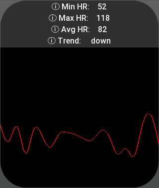
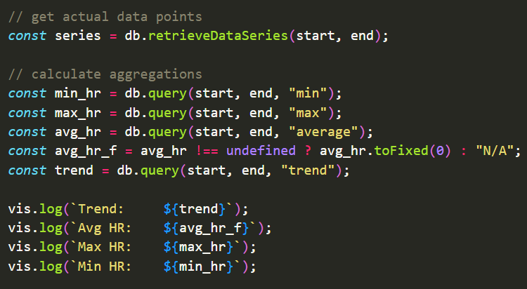

# 📦 Easy Storage Library for ZeppOS

### Description
The `Easy Storage` library offers a suite of storage solutions designed for ZeppOS applications, providing a range of data persistence strategies to accommodate different data management needs. With `EasyStorage`, `EasyFlashStorage`, and `EasyTempStorage`, developers can choose between in-memory storage, persistent file-based storage, and temporary volatile storage, making data handling both flexible and efficient.




## Installation
To install the library, run the following command from the root of your project:

`npm i @silver-zepp/easy-storage`

## ✨️ Examples

### 1. Using `EasyStorage` for Persistent Storage ✨️[[Read API]](./docs/easy-storage.md)
A lightweight, hybrid storage solution combining in-memory efficiency with filesystem persistence, ideal for small to medium-sized data.
```js
import EasyStorage from "@silver-zepp/easy-storage";
const storage = new EasyStorage();

storage.setKey("name", "John Doe");
console.log(storage.getKey("user")); // "John Doe"
```

### 2. Using `EasyFlashStorage` for Large, Persistent Storage ✨️[[Read API]](./docs/easy-flash-storage.md)
Designed for heavy-duty storage needs, it leverages filesystem-based persistence to handle large datasets without compromising performance and saving RAM.
```js
import { EasyFlashStorage } from "@silver-zepp/easy-storage";
const flash = new EasyFlashStorage();

flash.setKey("config", { theme: "dark", notifications: true, ... });
console.log(flash.getKey("config"));
```

### 3. Using `EasyTempStorage` for Temporary, Volatile Storage ✨️[[Read API]](./docs/easy-temp-storage.md)
Offers a transient, in-memory storage space for temporary data, ensuring fast access speeds and automatic clearance upon application closure.
```js
import { EasyTempStorage } from "@silver-zepp/easy-storage";
const temp = new EasyTempStorage();

temp.setKey("session", { token: "abc123" });
console.log(temp.getKey("session"));
```

### 4. Direct File Operations with `Storage` Utility ✨️[[Read API]](./docs/storage.md)
A utility library providing straightforward, static methods for direct file operations, simplifying reading and writing of data to the filesystem.
```js
import { Storage } from "@silver-zepp/easy-storage";

Storage.WriteFile("log.txt", "log entry example");
console.log(Storage.ReadFile("log.txt"));
```

### 5. Analyzing Time-Series Data with `EasyTSDB` ✨️[[Read API]](./docs/easy-tsdb.md)
Efficiently manage and analyze time-series data, supporting a wide array of aggregation functions for comprehensive data analysis, making it perfect for applications requiring detailed time-based insights.
```js
import EasyTSDB from "@silver-zepp/easy-tsdb";
const db = new EasyTSDB();

// write some data points
db.writePoint('temperature', 22.5);
db.writePoint('humidity', 55, Date.now() - 1000 * 60 * 60); // 1 hour ago

// query the average temperature over the last 2 hours
const start_time = Date.now() - 2 * 60 * 60 * 1000; // 2 hours ago
const end_time = Date.now();
const avg_temp = db.query(start_time, end_time, 'average');

console.log(`Average temperature over the last 2 hours: ${avg_temp}`);
```

# 📝 EasyStorage API Reference

### 1. [EasyStorage API](./docs/easy-storage.md)
### 2. [EasyFlashStorage API](./docs/easy-flash-storage.md)
### 3. [EasyTempStorage API](./docs/easy-temp-storage.md)
### 4. [Storage API](./docs/storage.md)
### 5. [EasyTSDB API](./docs/easy-tsdb.md)